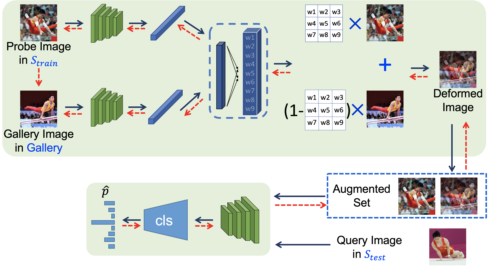

# Image Deformation Meta-Networks for One-Shot Learning

A PyTorch implementation of "Image Deformation Meta-Networks for One-Shot Learning"(CVPR 2019 Oral).

> [**Image Deformation Meta-Networks for One-Shot Learning**](<https://arxiv.org/abs/1905.11641>),            
> Zitian Chen, Yanwei Fu, Yu-Xiong Wang, Lin Ma, Wei Liu, Martial Hebert

# 





## Installation

```
python=2.7
pytorch=0.4.0
```

## Datasets

The data split is from [**Semantic Feature Augmentation in Few-shot Learning**](<https://github.com/tankche1/Semantic-Feature-Augmentation-in-Few-shot-Learning>)

```
Please put the data in:
/home/yourusername/data/miniImagenet

The images are put in 
.../miniImagenet/images
such as:miniImagenet\images\n0153282900000006.jpg
We provide the data split in ./datasplit/,please put them at 
.../miniImagenet/train.csv
.../miniImagenet/test.csv
.../miniImagenet/val.csv
```


## Train & Test

Notice that we train the model on **4 Titan X**. 42000MB GPU memory is required or may cause CUDA out of memory. 

```
# First, we fix the deformation sub-network and train the embedding sub-network with randomly deformed images

# We provide softRandom.t7 as the embedding sub-network
# if you want to train your own, run python classification.py --tensorname yournetworkname


# Then, we fix the embedding sub-network and learn the deformation sub-network 

# for 5-shot
CUDA_VISIBLE_DEVICES=0,1,2,3 python onlyBasetwoLoss.py --network softRandom --shots 5 --augnum 5 --fixCls 1 --tensorname metaNet_5shot --chooseNum 30 


# for 1-shot
# update attention
CUDA_VISIBLE_DEVICES=0,1,2,3 python onlyBasetwoLoss.py --network softRandom --shots 1 --augnum 7 --fixCls 1 --tensorname metaNet_1shot --nthreads 8 --chooseNum 15 


# If you want to further improve, then fix one sub-network and iteratively train the other. 

# update cls
CUDA_VISIBLE_DEVICES=0,1,2,3 python onlyBasetwoLoss.py --network softRandom --shots 5 --augnum 5 --fixCls 0 --fixAttention 1 --tensorname metaNet_1shot_round2 --chooseNum 30 --GNet metaNet_5shot 

Note that the training process are very sensitive to any change and there are two gaps: gap between loss and accuracy, gap between two sub-networks. In practice, we train several models in parallel with slightly changed parameters and pick the best one.


```


## License

IDeMe-Net itself is released under the MIT License (refer to the LICENSE file for details).


## Citation

If you find this project useful for your research, please use the following BibTeX entry.

    @inproceedings{chen2019deformation,
      title={Image Deformation Meta-Networks for One-Shot Learning},
      author={Zitian Chen, Yanwei Fu, Yu-Xiong Wang, Lin Ma, Wei Liu, Martial Hebert},
      booktitle={CVPR},
      year={2019}
    }
